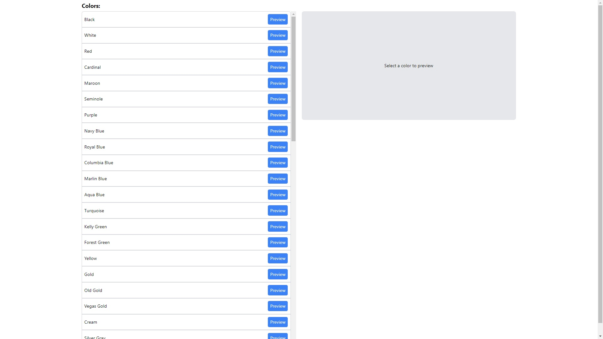
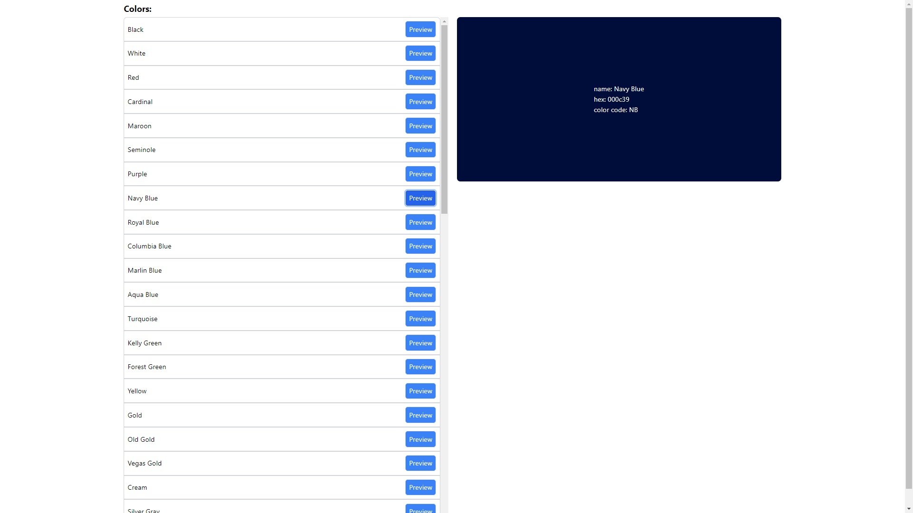

# Simple Color Picking App - Quickstrike Company

Welcome to the Simple Color Picking App developed for Quickstrike Company! This easy-to-use application allows you to pick and preview colors for your projects. Follow the instructions below to set up and run the app quickly.

## Screenshots

- Default
  

- Color Selected
  

## Getting Started

### Prerequisites

Before you begin, ensure you have the following installed on your machine:

- [Node.js](https://nodejs.org/): Make sure you have Node.js installed. You can download it from the official website.

### Installation

To get started with the Color Picking App, follow these steps:

1. Clone the repository to your local machine:

   ```bash
   git clone https://github.com/gcristianber/color-picking-app-qs.git
   ```

2. Change your directory to the project folder:

   ```bash
   cd color-picking-app-qs
   ```

3. Install the project dependencies using npm:

   ```bash
   npm install
   ```

   This command will install all the required packages and dependencies for the app.

## Running the App

Once you have installed the dependencies, you can start the Color Picking App using the following command:

```bash
npm run dev
```

This command will start a development server, and you should see a message indicating that the app is running. By default, the app will be accessible at `http://localhost:3000` in your web browser.

## How to Use

1. Open your web browser and navigate to `http://localhost:3000` (or the appropriate URL where your app is running).

2. You will see the Color Picking App interface, where you can select and preview colors for your projects.

3. The color list will show in your screen, each of them has a preview button that you can click.

4. The selected color will be displayed in the preview area along with its Name, HEX and Color Code.

## Additional Notes

- This app is a simple color picking tool developed for Quickstrike Company.
